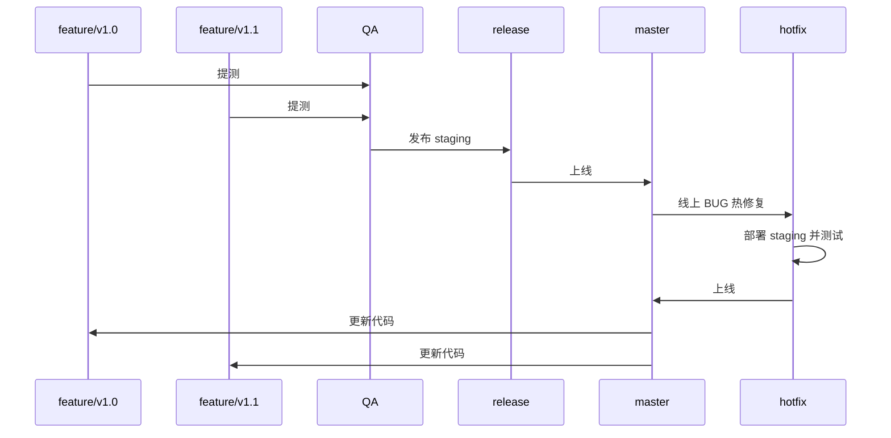

# 流程图

# 分支类型
## master
**主分支**，对应线上代码，记录项目的整个版本历史。

## release
**预上线分支**，对应 `staging` 环境代码。基本和 `master` 代码保持一致，但是因为有些条件下上线时间会较长，所以为了避免 `master` 分支和线上代码长时间不一致，我们独立出 `release` 分支做预上线代码托管。

## QA(test)
**提测分支**，QA 会使用这个分支上的代码部署到 `test` 环境。并且在 `test` 环境里做集成测试。当项目进行到提测阶段，需要以 `PR` 的方式将代码提交到 `QA` 分支进行提测。

## feature/*
**开发分支**，开发人员通过 `PR` 的形式将开发中的代码提交到此分支上。

