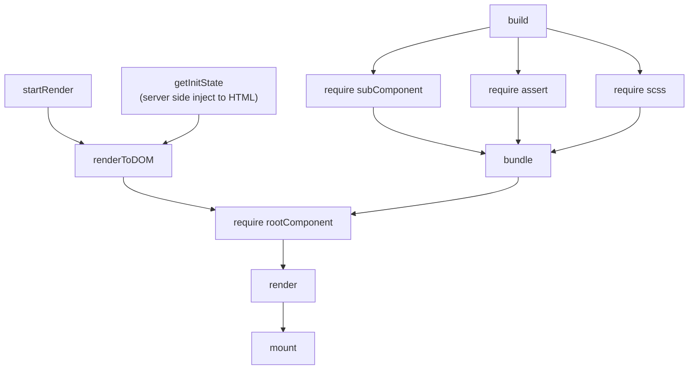
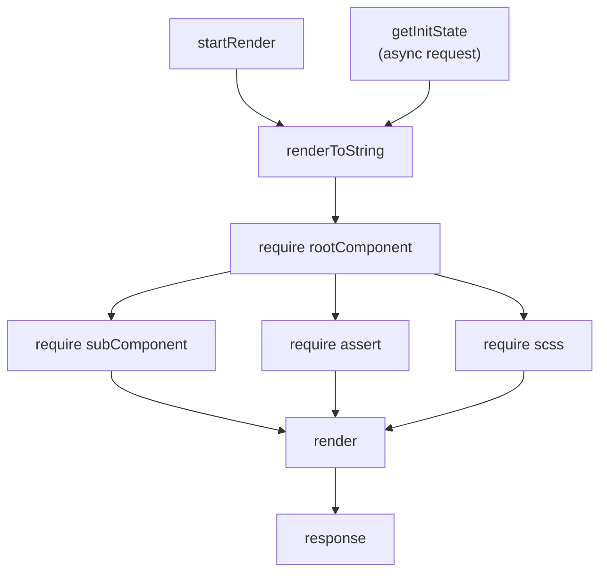

# 服务端渲染

## initState
在服务端渲染的场景里面，我们引入了一个比较重要的概念，叫做 `initState`，它是指**首屏渲染需要的数据**。在服务端/客户端同构渲染的场景里，很多情况我们要考虑怎么处理`initState`。

## 浏览器内渲染流程

在浏览器渲染过程中，首屏渲染的大致流程如下：


其中静态资源会预先通过 `webpack` 打包编译。`initState` 也会在服务端返回 HTML 的时候提前注入。

## 服务端渲染流程
服务端渲染和客户端大体相同，但静态资源没有提前打包，而是需要的时候实时引入：


通过图例对比，可以看出服务端渲染和客户端渲染在以下三个地方存在差异：
- `initState` 的获取方式
- 文件资源的引入方式
- 渲染结果的返回方式

## 对比
### initState 的获取方式
在 `src/server/routes/initState` 文件中，定义了每个页面渲染时候需要的初始化数据，同时也提供了对外的 http 接口。
```ts
// 服务端脚本
const prefix = '/state';
export default class PageStageController {
  // tslint:disable-next-line:no-any
  getState(ctx: Context): any {
    const result = match(this, `${prefix}${ctx.path}`);
    if (result) {
      ctx.params = result.params;
      return result.fn.call(this, ctx);
    }
    return null;
  }

  @route('get', `${prefix}/home`)
  index(ctx: Context): HomePageInitState {
    ctx;
    return {
      title: 'hello world',
    };
  }

  @route('get', `${prefix}/*`)
  notFound() {
    return {};
  }
}
```
上面定义了访问 `/home` 路径的时候，`initState` 的值是 `{title: "hello world"}`。同时通过装饰器的形式对外暴露出了地址为 `/state/home` ，也可以获取这个页面的 `initState`。在 SPA 项目中，页面切换的时候会需要从 HTTP 接口里获取 `initState`。

```ts
// 服务端脚本
const ctx: Koa.Content = {
	...
	path: '/home',
}
const pageStateController = new PageStageController();
const pageState = await pageStateController.getState(ctx);

if (options.serverRender) {
	// 在服务端渲染的场景里可以在这里使用 pageState
	ReactDOMServer.renderToString(App, ...);
	...
}

return `<html>
	<header>
		<script>var pageState = {
			"${ctx.path}": ${JSON.stringify(pageState)}
		}</script>
	</header>
</html>`;
```

在服务端渲染 HTML 之前，首选要生成页面的 `initState` （如果开启服务端渲染的话，可以通过这些数据直接渲染出页面）。再将数据序列化到 HTML 的`script`脚本中，这样客户端就可以在全局变量里访问到 `initState`了。

```ts
// 客户端脚本
ReactDOM.render(<App
	initState={pageState[location.pathname]}
>, document.getElementById('app'));
```

在客户端渲染的时候，因为所引用的 `initState` 一致，所以渲染结果也会一致。

### 文件资源的引入方式 
在客户端中，我们所有的静态资源都是由 webpack 打包的，相关的 loader 会处理具体引入方式。
但是服务端渲染的时候，就需要我们自己处理对于图片、css 等资源的引入了。

在 `src/server/lib/requireExtensions` 文件中，通过扩展 `require.extensions` 的方式定义了对静态资源的引入方式。
对于不同文件类型，返回值也不同：
- 图片：返回文件的地址
- css：不返回内容

### 渲染结果的返回方式
在客户端中，通过 `ReactDOM.render` 方法，将渲染结果插入到 DOM 中。服务端渲染的场景里，通过`ReactDOMServer.renderToString`的方式渲染出 HTML 字符串，然后再注入到生成的 HTML 里。

## 对于异步组件的处理
参考[异步组件&代码分割](./guides/异步组件&代码分割.md)
