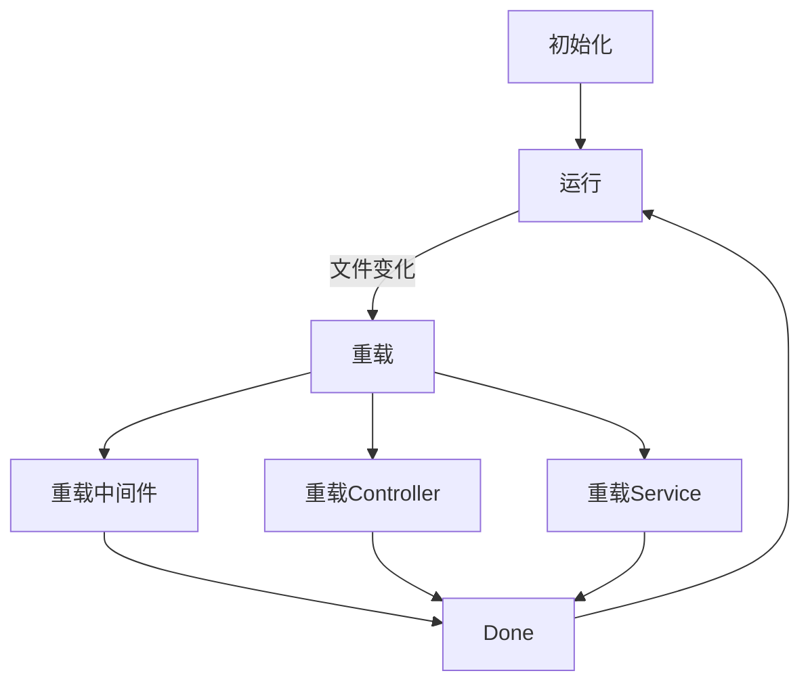
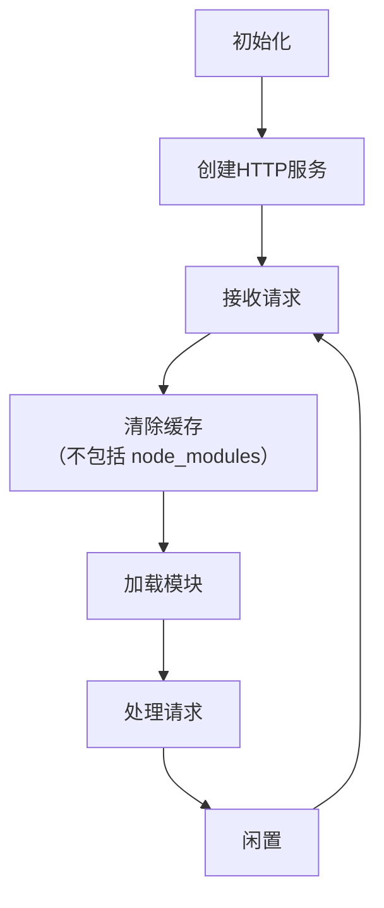

# 服务端热加载

## Turbo 实现服务端热加载的方式
[Turbo](http://turbo.sankuai.com/) 是公司提供的前端工程化方案，他包含前端构建、同构渲染、服务端集成等功能。

Turbo 采用 `watch` 文件并重载的方式来实现服务端热加载。

这样做的优点是速度比较快，每个文件更改之后单独对这个文件做重载即可，webpack 用的也是类似的方法。
但是缺点是需要对每种类型的文件定制重载方法，有些文件甚至不能进行重载，比如说 `utils`, `lib`。

## project-starter 

`project-starter` 项目中也有类似的功能，可以使得开发者在改变服务端代码之后不需要手动重启即可立即生效。但是他并不是采用「热加载」，而是采用比较粗暴的方法：每次处理请求之前清除 `require` 缓存。

这么做虽然会导致每次请求所有的模块都需要重新加载会有些耗费性能，但是从实际的开发体验上来说并没有太大的差别。这种方法的优点也是很明显的，项目中所有文件的改动都可以不用重启服务即生效，而且只需要不到 10 行的代码即可实现。

项目中涉及到的文件: `src/server/dev-server`
