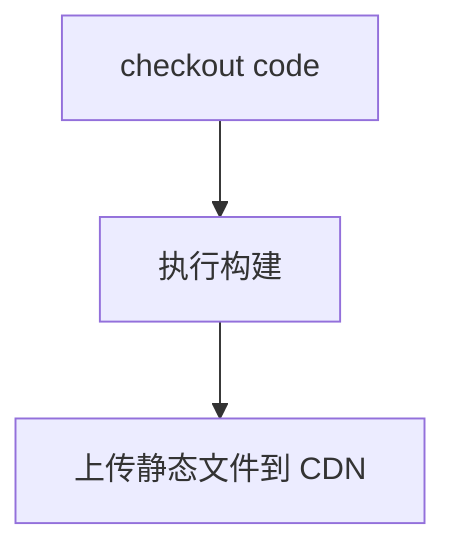

# 静态资源部署
前端项目统一采用 [BuildService](http://static.sankuai.com) 做静态资源的部署。整个部署流程是在发布机上执行的:


在构建过程中也会生成一份 webpack 构建状态文件，名为 `buildMeta.json`，文件记录了构建文件列表，以及相对应的 `chunkName`。
这份文件会跟随服务端代码一起发送到服务器上，服务端在渲染 HTML 的时候，会根据这份文件清单注入多条 `<script>` 标签，这样就能实现多脚本并行加载，提高前端性能了。

buildMeta.json
```json
{
 "assetsByChunkName": {
    "MobilePosPage": "0.2206209a88526986d5f4.js",
    "HomePage": "1.2206209a88526986d5f4.js",
    "CrmPage": "2.2206209a88526986d5f4.js",
    "WeixinCharts": "3.2206209a88526986d5f4.js",
    "PosPage": "4.2206209a88526986d5f4.js",
    "ErpPage": "5.2206209a88526986d5f4.js",
    "SupplyChainPage": "6.2206209a88526986d5f4.js",
    "ProductGuidePage": "7.2206209a88526986d5f4.js",
    "FAQPage": "8.2206209a88526986d5f4.js",
    "AboutPage": "9.2206209a88526986d5f4.js",
    "SearchVideoPage": "10.2206209a88526986d5f4.js",
    "VideoContentPage": "11.2206209a88526986d5f4.js",
    "SearchPage": "12.2206209a88526986d5f4.js",
    "FAQContentPage": "13.2206209a88526986d5f4.js",
    "FAQDetailPage": "14.2206209a88526986d5f4.js",
    "app": [
      "app.2206209a88526986d5f4.js",
      "app.a147a10c.css"
    ]
  }
}
```

相关文档：
- [BuildService](http://static.sankuai.com/?e=guide&i=i)
